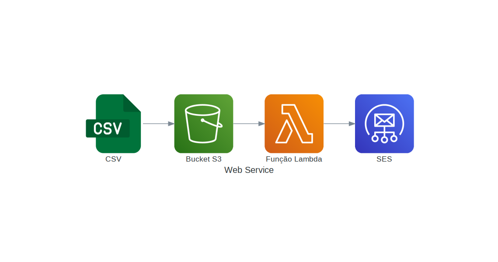

# Projeto de envio de email com S3, Função Lambda, SES e Framework serverless

Esse projeto usando o S3 para receber um arquivo `.csv` que despara um evento de uma função Lambda, como isso, o códido da função lambda ler o arquivo `.csv` do Bucket do S3 e envia um email para todos os emails do arquivo.

<p align="center">
  
</p>


<p id="roadmap"> 
  <ul>
    <h3>Requisitos do projeto:</h3>
    <p>
    <li>⚙️ <a href="https://www.serverless.com/framework/docs/getting-started">Serverless Framework</a></li>
    <li>⚙️ <a href="https://www.python.org">Python3</a></li>
    <li>⚙️ <a href="https://pypi.org/project/boto3/">Boto3</a></li>
  </ul>
</p>


### Colocar em Produção

Para colocar em produção o projeto, usa-se o comando do sercerless instalado em sua máquina, você deve esta dentro da pasta que contem o arquivo `serveraless.yml`.

```
serverless deploy
```

### Instalando dependência

Para instalar a dependência `serverless-s3-cleaner` que deleta o bucket s3 após o teste, usa-se o comando abaixo:

```bash
serverless plugin install -n serverless-s3-cleaner
```

Após realizar seus testes, você pode deletar o bucket no s3 usando o sefuinte comando:

```bash
serverless remove
```