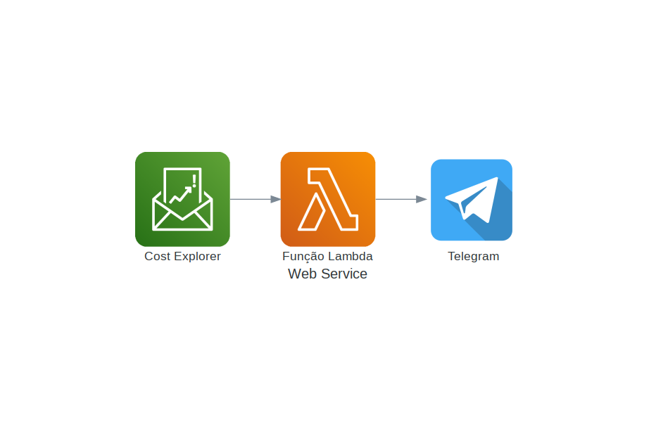

# AWS Lambda com Python e Serverless Framework

<h3  id="techs">Tecnologias</h3>

   
  </ul>
   

## Descrição

Este projeto utiliza o AWS Lambda em conjunto com o #Serverless Framework. O objetivo é integrar serviços da AWS com um bot do Telegram. Neste exemplo específico, foi implementada uma função #Lambda que obtém o custo mensal de gastos na AWS e envia essa informação para um bot no Telegram em intervalos predefinidos.

  

